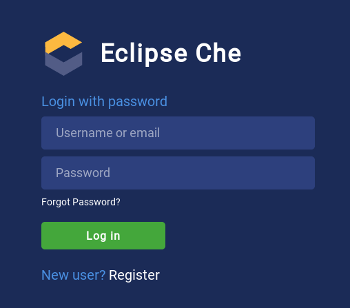
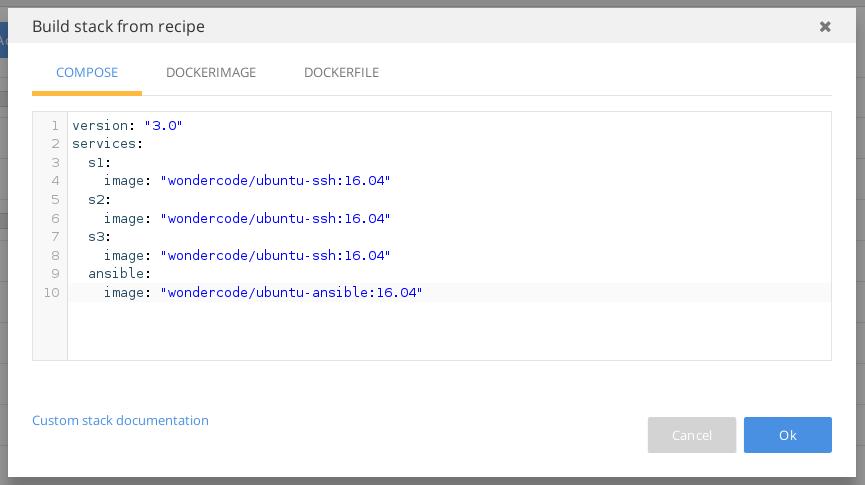
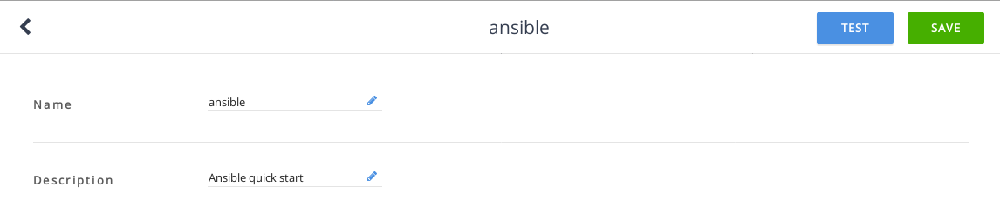
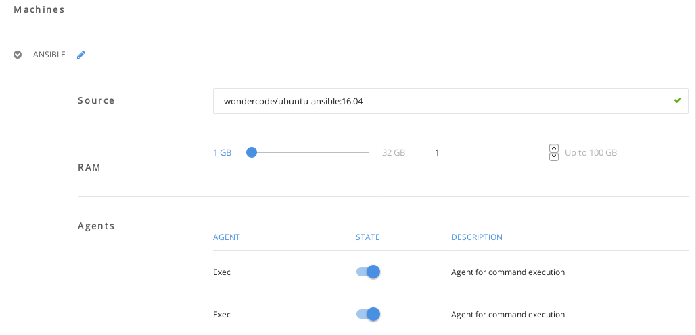
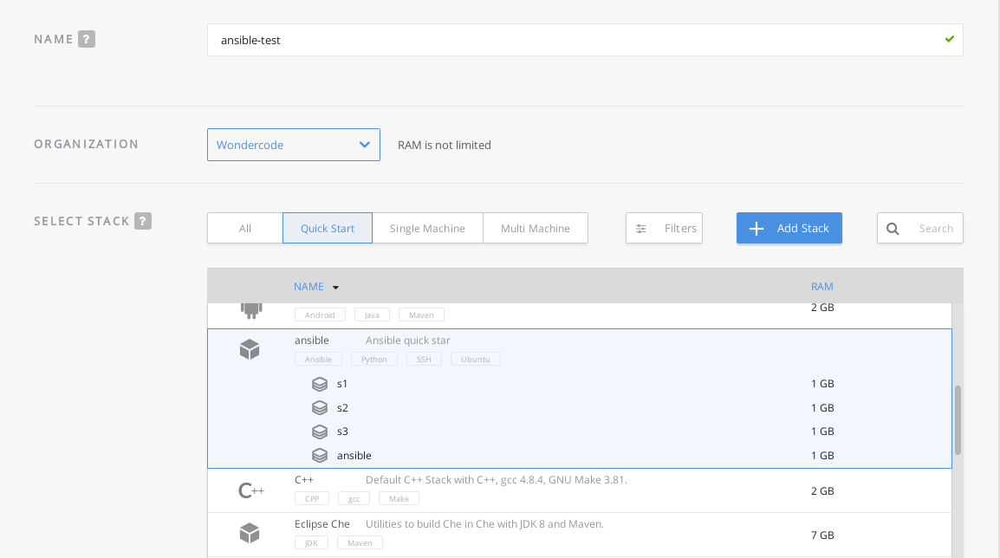
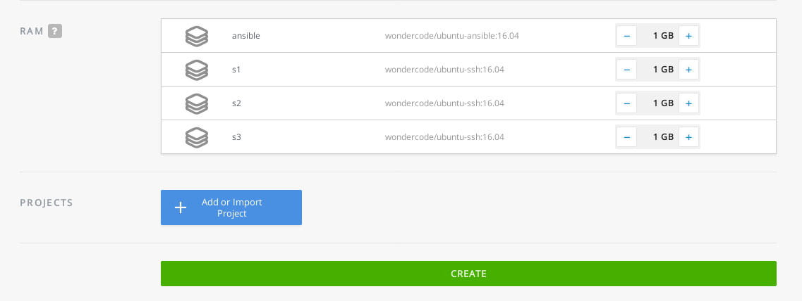
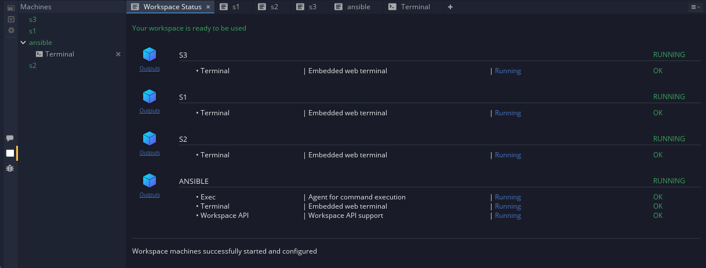

# Ansible quick start using Docker and Eclipse Che
If you want to start playing with Ansible and don't want to create several VMs or don't have physical hosts, this is a good place to start.  

Using docker you can create a private network for your virtual hosts and play with Ansible.  
Eclipse Che allows you to interact with those virtual hosts in a integrated and "natural" environment.  
**Let's start!.**
# 1. Setup a new stack in Eclipse Che.
- Login into  Eclipse Che console.  

- Select "Stacks" and click "Build Stack From Recipe".
- In Compose Tab paste the content of [docker-compose.yml](https://github.com/WilliamMolina/ansible-che/blob/master/docker-compose.yml) file and click "OK".  

- Set name and description for the new stack.  

- Enable Exec, Terminal and Workspace API to "ANSIBLE" machine.

- For S's machines enable just Terminal.
- Click "Save".

Now you have a new Stack with four machines: one with ansible and three "servers".
Let's create a new workspace with that stack and start playing wth ansible.

# 2. Create a new workspace

- Go to workspaces section in Eclipse Che.
- Click "Add Workspace".
- Set the name for the new workspace.
- Select the stack created before.  

- Click "Create".  

**And we are done!.**

# 3. Play with Ansible
Open the new workspace.  

## Generate ssh key
From ansible machine run the following command:  
 `ssh-keygen -t rsa`

## Copy ssh key to hosts
Again, from ansible machine run `ssh-copy-id hostname` for every server (s1, s2 and s3).

## Install ping in all hosts
 `ansible all -m apt -a "name=iputils-ping state=present"`

## Do the same with a  playbook
`ansible-playbook example.yml`

# Code
All files used to build Docker images, create Eclipse Che Stacks and configure Ansible hosts are available and you are free to modify them as you want.
## For more information visit:
- [Docker Documentation](https://docs.docker.com/)
- [Eclipse Che Documentation](https://www.eclipse.org/che/docs/)
- [Ansible Documentation](http://docs.ansible.com/)
